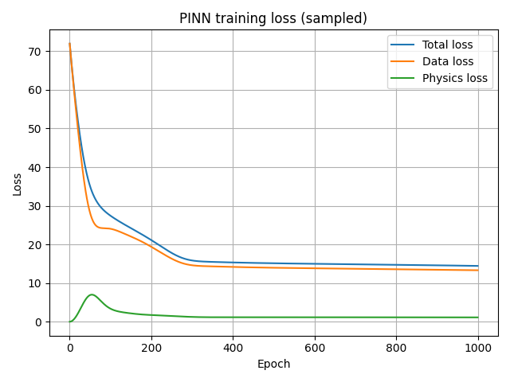
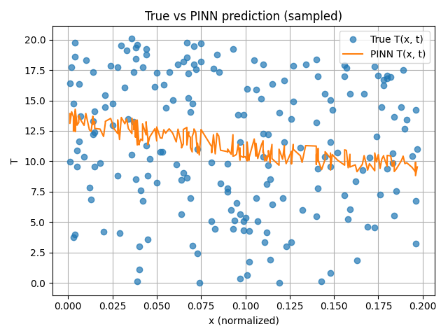
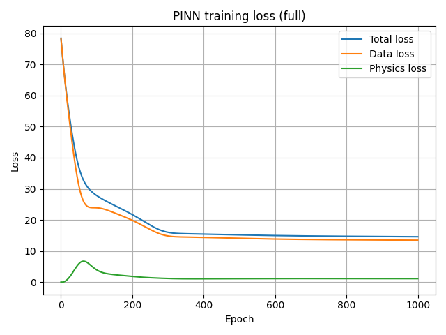
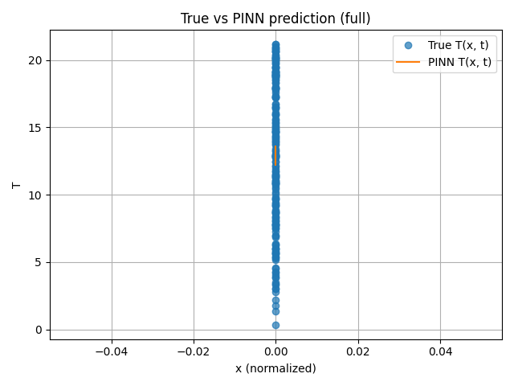

# TECHNICAL ANALYSIS  
**Лабораторна робота №4 — Physics-Informed Neural Networks (PINN)**

## 1. Постановка задачі

Мета — навчити PINN відтворювати температуру стрижня `T(x, t)` за даними з CSV і **одночасно** виконувати рівняння теплопровідності:

$$
\frac{\partial u}{\partial t} = \alpha \frac{\partial^2 u}{\partial x^2}, \quad u(x,t) \approx T(x,t).
$$

Вхід мережі:  

- просторові координати `x`;  
- час `t`.

Вихід:  

- скалярна величина `u(x, t)` (апроксимація `T`).

Використано два набори даних (однакова структура колонок `x, t, T`):

1. **`data_sampled.csv`** — підвибірка (~5000 рядків), 4000 train / 1000 test;
2. **`data.csv`** — повний набір (~3.6 млн рядків), 2 883 681 train / 720 920 test.

---

## 2. Архітектура PINN та функція втрат

### 2.1. Модель

Архітектура описана в `pinn_model.py`:

- вхідний шар: 2 нейрони (x, t);
- 2 прихованих шари по 50 нейронів з активацією `tanh`;
- вихідний шар: 1 нейрон (без активації) — значення `u(x, t)`.

Це проста feed-forward мережа, яка апроксимує гладку функцію.

### 2.2. Фізичний (PDE) лосс

В `physics.py` реалізовано обчислення залишку PDE:

$$
r(x, t) = \frac{\partial u}{\partial t} - \alpha \frac{\partial^2 u}{\partial x^2}.
$$

Похідні беруться через `tf.GradientTape`:

- `u_t = \partial u / \partial t`;
- `u_xx = \partial^2 u / \partial x^2`.

Фізичний лосс:

$$
L_{\text{phys}} = \mathbb{E}\big[ r(x, t)^2 \big].
$$

### 2.3. Загальна функція втрат

У `trainer.py`:

$$
L_{\text{total}} = L_{\text{data}} + L_{\text{phys}},
$$

де

$$
L_{\text{data}} = \mathbb{E}\big[(u_{\text{pred}} - u_{\text{true}})^2\big].
$$

Оптимізатор: **Adam**, `learning_rate = 1e-3`, `NUM_EPOCHS = 1000`.  
Коефіцієнт теплопровідності: `ALPHA = 0.01`.

---

## 3. Експеримент 1 — `data_sampled.csv`

### 3.1. Розмір вибірки

- Train: 4000 точок;  
- Test: 1000 точок.

### 3.2. Динаміка лоссів

Графік (збережений після запуску `main.py`):

- Старт:
  - `Total loss ≈ 72`;
  - `Data loss ≈ 72`;
  - `Physics loss ≈ 0.0016` (майже нуль — мережа ще нічого не вміє, але на випадкових вагових коефіцієнтах PDE випадково майже виконується в середньому).
- Близько 100-ої епохи:
  - `Physics loss` підстрибує до ~3–4 — модель підганяє дані, порушуючи PDE.
- Після ~200-ої епохи:
  - усі три лосси монотонно спадають.
- До кінця навчання:
  - `Data loss ≈ 13.5`,
  - `Physics loss ≈ 1.1`,
  - `Total loss ≈ 14.6`.

**Висновок:** мережа знаходить компроміс — вона не ідеально відтворює ні дані, ні PDE, але обидва критерії виконуються “помірно добре”.

### 3.3. Якість на тесті

- Фінальний **Test MSE (sampled)**: `≈ 1.34 × 10¹` (приблизно 13.4).

З огляду на те, що значення `T` лежать приблизно в діапазоні 0–20, це означає помилки помірної величини, але модель у цілому відтворює тренд.

### 3.4. Вигляд прогнозів

Графік:

- По осі X — нормалізований `x` (0…0.2, взята підмножина точок), по осі Y — температура `T`.
- Сині точки (`True T(x, t)`) сильно розкидані — змішані точки з різних моментів часу `t`.
- Помаранчева крива (`PINN T(x, t)`) — гладка, приблизно спадна функція.

**Інтерпретація:** PINN намагається задовольнити PDE, тому рішення стає гладким та усередненим; локальні флуктуації даних згладжуються.

---

## 4. Експеримент 2 — `data.csv` (повний датасет)

### 4.1. Розмір вибірки

- Train: 2 883 681 точок;  
- Test: 720 920 точок.

### 4.2. Динаміка лоссів

Графік:

Криві дуже схожі на експеримент з підвибіркою:

- Старт:
  - `Total loss ≈ 78`,
  - `Data loss ≈ 78`,
  - `Physics loss ≈ 0.05`.
- Після 100 епох:
  - `Physics loss ≈ 3.9`, `Data loss` помітно падає.
- Після 300–400 епох:
  - `Data loss ≈ 14.8…14.4`,
  - `Physics loss ≈ 1.1`,
  - `Total loss ≈ 15.4…15.0`.
- До кінця:
  - `Data loss ≈ 13.5`,
  - `Physics loss ≈ 1.12`,
  - `Total loss ≈ 14.7`.

### 4.3. Якість на тесті

- Фінальний **Test MSE (full)**: `≈ 1.35 × 10¹` (приблизно 13.5).

Результат майже не відрізняється від експерименту на `data_sampled.csv`.

### 4.4. Вигляд прогнозів

Графік:

- Вибрана невелика підмножина тестових точок (перші 200, відсортовані за `x`).
- Через масштабування по осі X усі точки виглядають як вузька “колонка”.
- PINN відтворює гладку поведінку `T` по цьому зрізу.

**Висновок:** поведінка моделі якісно та кількісно дуже схожа на випадок з підвибіркою.

---

## 5. Порівняння `sampled` vs `full`

### 5.1. Як змінюється якість

- `Test MSE (sampled) ≈ 13.40`;  
- `Test MSE (full)    ≈ 13.47`.

Різниця **менша 1%**.

> Додавання величезної кількості точок (з ≈5k до ≈3.6M) майже не покращило результат.

Причини:

1. **Надлишковість даних:** усі точки отримані з одного аналітичного розв’язку PDE; сотень/тисяч точок достатньо, щоб побачити структуру розв’язку.
2. **Обмежена потужність моделі:** невелика мережа (2×50 нейронів) не здатна ідеально відтворити складний розв’язок незалежно від обсягу даних.
3. **Фіксований баланс лоссів:** `L_total = L_data + L_phys`. Physics loss не домінує, модель зупиняється на схожому компромісі для обох датасетів.

### 5.2. Що показує цей результат про PINN

- **Data efficiency:** навіть невелика вибірка дозволяє PINN знайти розв’язок, близький до того, що дає повний датасет.
- **Роль фізики:** physics loss згладжує рішення й не дозволяє моделі занадто переобучуватися на локальні шуми.

---

## 6. Обмеження й можливі покращення

1. **Баланс між data та physics loss**  
   Зараз:

   $$
   L_{\text{total}} = L_{\text{data}} + L_{\text{phys}}.
   $$

   Можна ввести вагу \(\lambda\):

   $$
   L_{\text{total}} = L_{\text{data}} + \lambda L_{\text{phys}}
   $$

   і дослідити, як змінюється якість та форма розв’язку.

2. **Масштабування цільової змінної**  
   Зараз нормалізуються тільки `x` і `t`.  
   Можна нормалізувати й `T` (наприклад, до нульового середнього та дисперсії 1), щоб стабілізувати навчання.

3. **Складніша архітектура**  
   - більше шарів / нейронів;
   - інші активації (ReLU, Swish, Sin);
   - регуляризація (L2, dropout).

4. **Collocation points**  
   Physics loss зараз обчислюється в тих самих точках, що й data loss.  
   Класичні PINN часто використовують додаткові колокаційні точки, щоб краще контролювати PDE у всій області.

5. **Граничні та початкові умови**  
   У поточному варіанті вони явно не виділені в окремий лосс.  
   Додавання окремих термів для boundary/initial conditions може підвищити точність.

---

## 7. Загальні висновки

1. Реалізована PINN-модель успішно навчається одночасно на даних і PDE-обмеженні: обидва типи loss зменшуються до стійких значень.
2. Результати на малому (`data_sampled.csv`) і повному (`data.csv`) датасетах майже однакові — це ілюструє **дано-ефективність PINN** для задач із відомою фізикою.
3. Physics loss змушує модель продукувати гладкі, фізично узгоджені рішення, навіть якщо дані містять флуктуації.
4. Поточна якість (Test MSE ~13.4–13.5) залишає простір для покращення, зокрема через:
   - зміну ваги physics loss;
   - ускладнення архітектури;
   - нормалізацію цільової змінної;
   - явне врахування граничних/початкових умов.

Цей проєкт можна використовувати як шаблон: замінювати PDE, підключати інші датасети або додавати власні модифікації до PINN.
